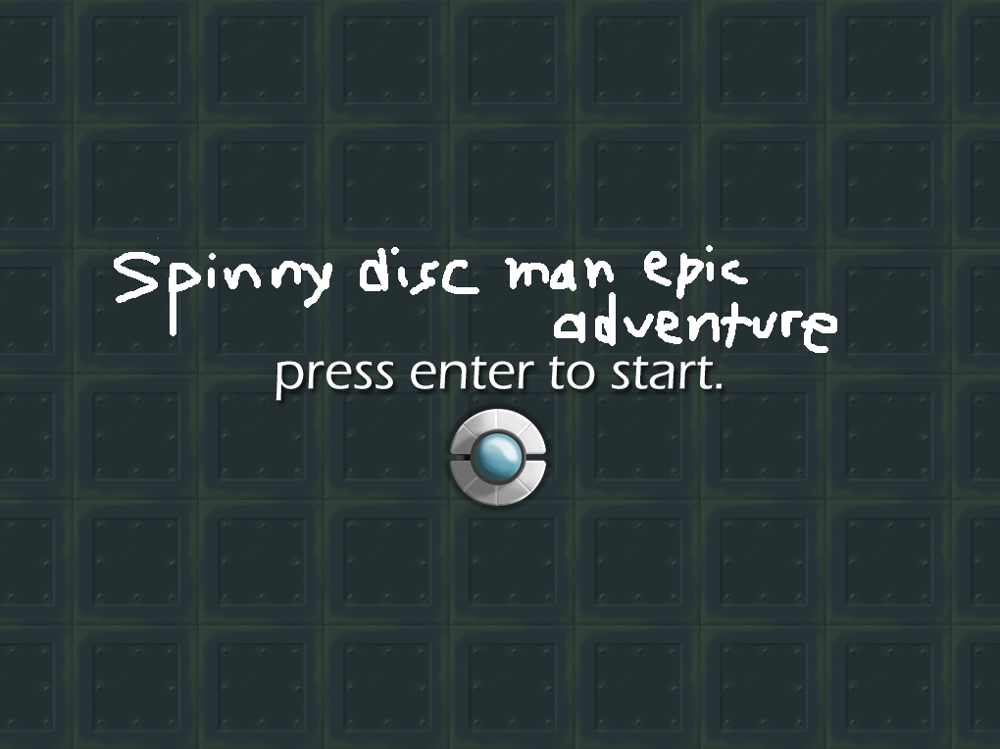

# Spinny-Disc-Man-Epic-Adventure
Second GameMaker Studio 2 project for my CIT160 course (Game and Simulation Programming)

## Purpose
Learning how to use GameMaker. Created by following [this tutorial](https://www.youtube.com/watch?v=IWXJbUHLYXA&list=PLhIbBGhnxj5IF9saL3KNqeJqHKGHHeLFh).

Same game, but with a few changes.

## Summary
You're a UFO going around and destroying green, virus like enemies by shooting them

### Changes
- Changed bullet cooldown to 10
- Changed arrow key controls to wasd controls
- Doubled height of room
- Set camera start position to {512, 384}
- Added walls to prevent player from going out of bounds
- Used "Draw GUI" event in score object instead of standard draw
- Set position of score to {window_get_width() / 2, 32}
- Used Algerian font for score
- Added ability for bullets to ricochet off of the walls cause why not
